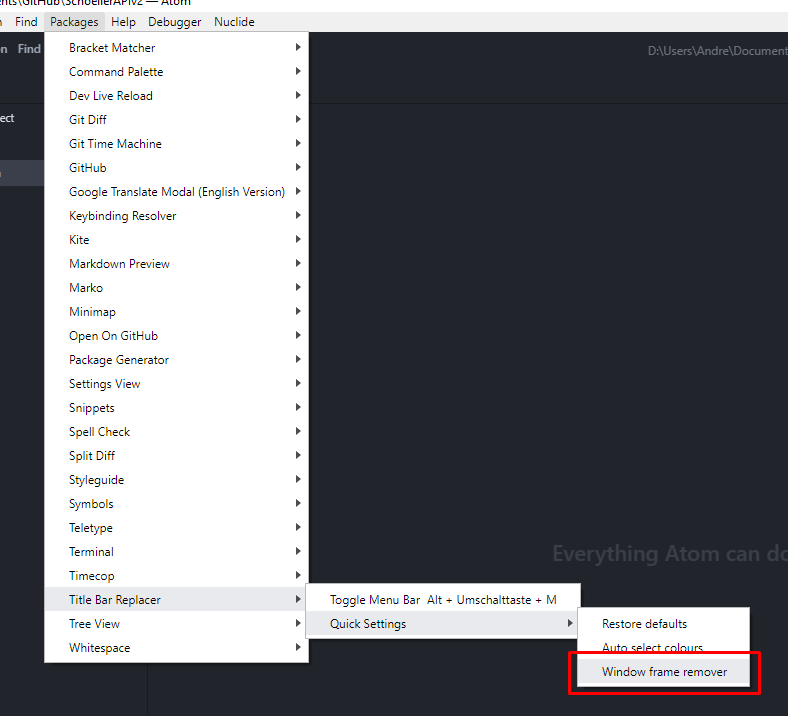
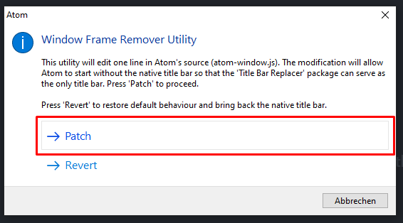
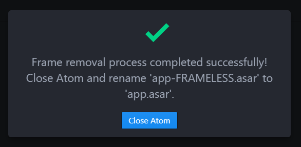

# Atom.io Customization :alien:

This repository offers an automatic install script for **Atom.io** customization! :fire:  
This Atom.io setup includes a fully IDE with Debugger for Web development with Node.js.

### Requirements

- Atom.io
- Node.js

### Installation Guide

1.  Download atom-io-customization zip archive from windows branch [here](https://github.com/Teddy95/atom-io-customization/archive/windows.zip)
2.  Execute `install.bat`

### Backup your Atom.io environment for new installation

Execute `backup.bat`

### Remove Title Bar

	
Click on <code>Window frame remover</code>.

	

	
And then on <code>Patch</code>.

	

	
Afterwards close Atom and rename <code>app-FRAMELESS.asar</code> to <code>app.asar</code> in <code>AppData\Local\atom\app-x.x.x\resources</code>.

	

### Included Atom.io packages

Packages from <https://atom.io/packages> ⇒ `apm install <package>`

- atom-ide-debugger-node
- atom-ide-ui
- busy-signal
- color-picker
- docblockr
- file-icons
- flex-tool-bar
- git-time-machine
- google-translate-modal-English-Version
- ide-php
- ide-typescript
- kite
- language-batch
- language-docker
- language-marko
- linter-htmlhint
- linter-jshint
- linter-sass-lint
- minimap
- one-dark-monokai
- split-diff
- teletype
- terminal-tab
- title-bar-replacer
- tool-bar

### Included Node.js packages

Packages from <https://www.npmjs.com/> ⇒ `npm install <package>`

- [ ] jshint
- [ ] htmlhint
- [ ] sass-lint

**Note:** _Node.js packages aren't included in install script!_

### Included configuration files

##### Configuration files for Atom.io, Packages & Linters ⇒ `~/.atom` Directory

⇒ [Show files](https://github.com/Teddy95/atom-io-customization/tree/master/atom)

### License

