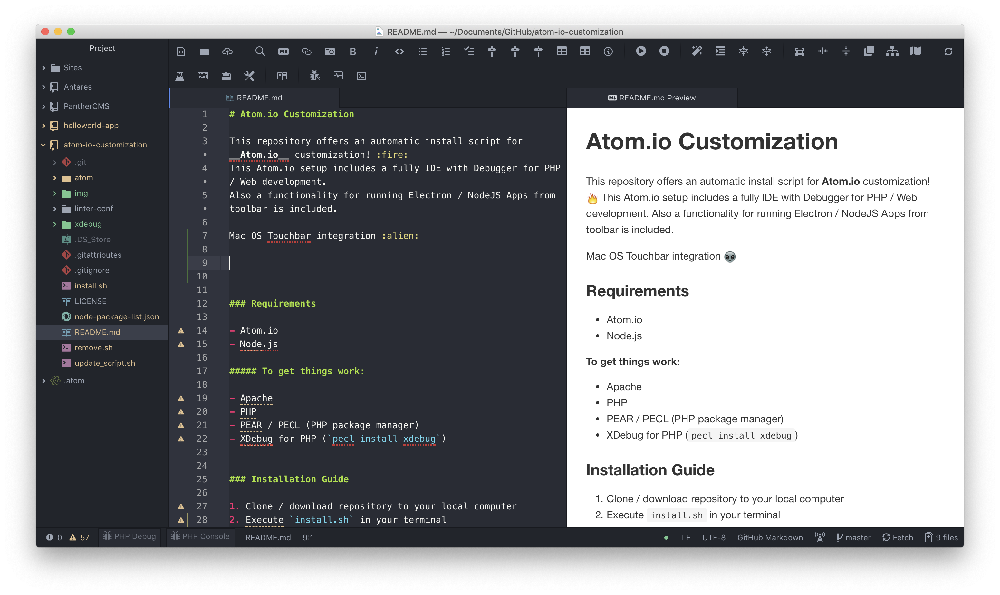
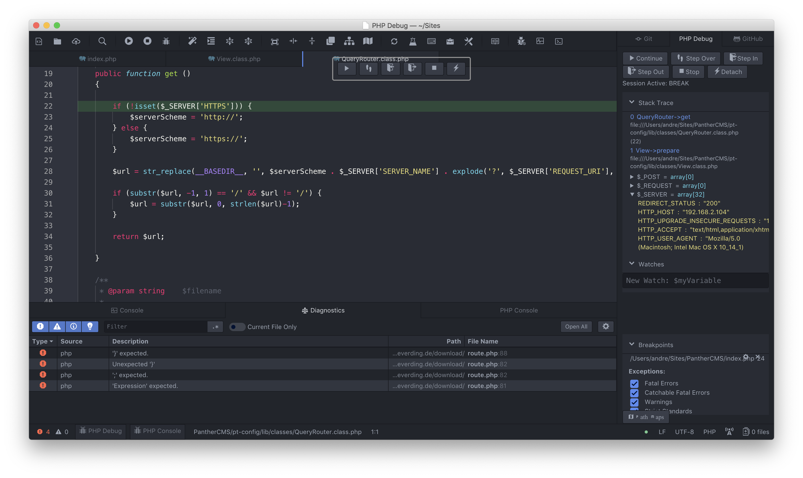
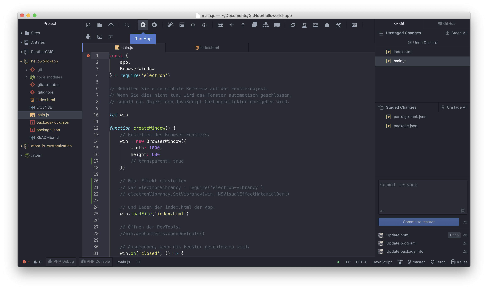
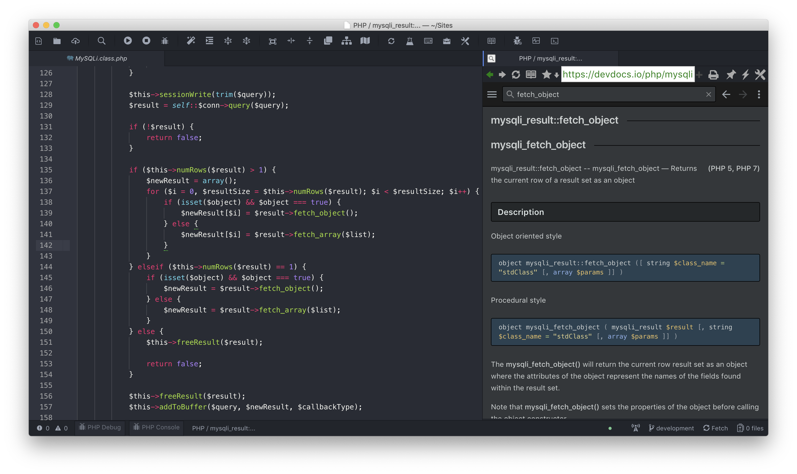
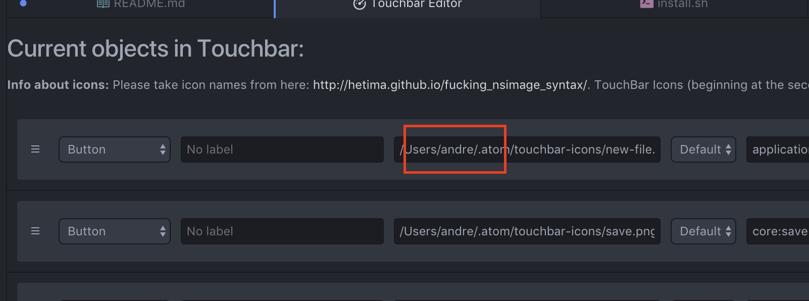

# Atom.io Customization

This repository offers an automatic install script for **Atom.io** customization! :fire:
This Atom.io setup includes a fully IDE with Debugger for PHP / Web development.
Also a functionality for running Electron / NodeJS Apps from toolbar is included.

Mac OS Touchbar integration :alien:

### Requirements

-   Atom.io
-   Node.js

##### To get things work:

-   Apache
-   PHP
-   PEAR / PECL (PHP package manager)
-   XDebug for PHP (`pecl install xdebug`)

### Installation Guide

    $ git clone https://github.com/Teddy95/atom-io-customization
    $ ./install.sh

### Backup your Atom.io environment for new installation

    $ ./backup.sh

### Configurate Touchbar

1.  Go to `Packages ⇒ touchbar ⇒ Edit Touchbar`
2.  Insert your username / path to icon (`~/.atom/touchbar-icons`)
    

### Included Atom.io packages

Packages from <https://atom.io/packages> ⇒ `apm install package-name`

-   [x] atom-beautify
-   [x] atom-debug-ui
-   [x] atom-html-preview
-   [x] atom-ide-debugger-node
-   [x] atom-ide-ui
-   [x] atom-toolbar-preferred
-   [x] browser-plus
-   [x] busy-signal
-   [x] color-picker
-   [x] docblockr
-   [x] file-icons
-   [x] ide-php
-   [x] intentions
-   [x] language-swift
-   [x] linter
-   [x] linter-csslint
-   [x] linter-htmlhint
-   [x] linter-jshint
-   [x] linter-jsonlint
-   [x] linter-less
-   [x] linter-markdown
-   [x] linter-php
-   [x] linter-sass-lint
-   [x] linter-swiftc
-   [x] linter-ui-default
-   [x] linter-xmllint
-   [x] markdown-writer
-   [x] minimap
-   [x] minimap-linter
-   [x] multi-cursor
-   [x] npm-plus
-   [x] one-dark-monokai
-   [x] open-in-browser
-   [x] php-debug
-   [x] semantic-ui
-   [x] teletype
-   [x] tool-bar
-   [x] touchbar

### Included Node.js packages

Packages from <https://www.npmjs.com/> ⇒ `npm install package-name`

-   [x] asar
-   [x] electron-packager
-   [x] jshint
-   [x] jsonlint
-   [x] less
-   [x] sass-lint

**Note:** _Node.js packages aren't included in install script currently!_

### Included configuration files

##### Configuration files for Atom.io & packages ⇒ `~/.atom` Directory

⇒ [Show files](https://github.com/Teddy95/atom-io-customization/tree/master/atom)

##### Configuration files for Linters ⇒ `~/` Directory

⇒ [Show files](https://github.com/Teddy95/atom-io-customization/tree/master/linter-conf)

##### Configuration file for XDebug ⇒ `./extra` inside Directory which contains `php.ini`

-   xdebug/ext-xdebug.ini

**Note:** _Set the IP address in XDebug ini file / php-debug settings to your local ip, which you've got by your router._

### License

