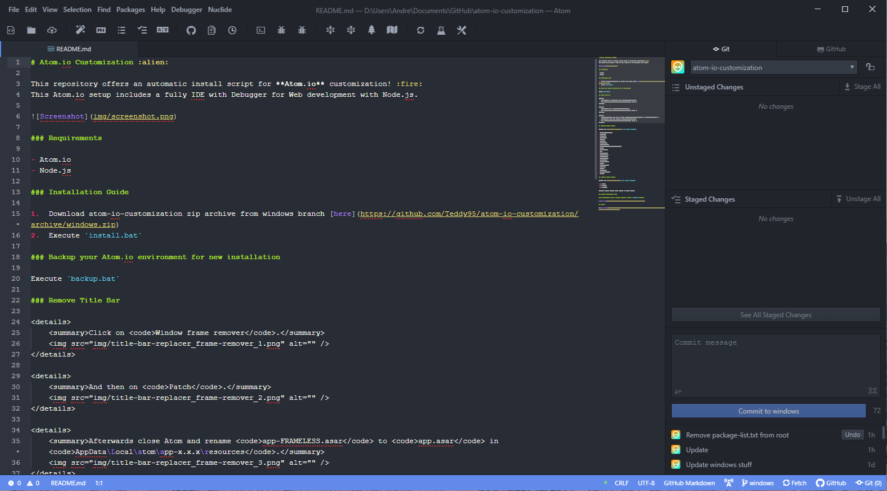

# Atom.io Customization

This repository offers an automatic install script for **Atom.io** customization! :fire:
This Atom.io setup includes a fully IDE with Debugger for PHP / Web development.
Also a functionality for running Electron / NodeJS Apps from toolbar is included.



Mac OS Touchbar integration :alien:


### Requirements

-   Atom.io
-   Node.js

##### To get things work:

-   Apache
-   PHP
-   PEAR / PECL (PHP package manager)
-   XDebug for PHP (`pecl install xdebug`)

### Installation Guide

##### Mac OS X

```shell
# Clone repository
$ git clone https://github.com/Teddy95/atom-io-customization.git

# Change directory
$ cd atom-io-customization

# Execute install.sh
$ ./install.sh
```

##### Windows

1.  Download atom-io-customization zip archive [here](https://github.com/Teddy95/atom-io-customization/archive/master.zip)
2.  Execute `install.bat`

### Backup your Atom.io environment for new installation

##### Mac OS X

    $ ./backup.sh

##### Windows

Execute backup.bat

### Configurate Touchbar

1.  Go to `Packages ⇒ touchbar ⇒ Edit Touchbar`
2.  Insert your username / path to icon (`~/.atom/touchbar-icons`)
    

### Included Atom.io packages

Packages from <https://atom.io/packages> ⇒ `apm install <package>`

- atom-npm
- busy-signal
- color-picker
- docblockr
- file-icons
- flex-tool-bar
- git-diff-details
- git-projects
- git-time-machine
- google-translate-modal-English-Version
- ide-php
- intentions
- language-batch
- language-marko
- linter
- linter-htmlhint
- linter-jshint
- linter-php
- linter-sass-lint
- linter-ui-default
- markdown-commander
- merge-conflicts
- minimap
- no-title-bar
- one-dark-monokai
- split-diff
- teletype
- terminal-tab
- tool-bar
- touchbar
- xatom-debug
- xatom-debug-nodejs
- xatom-debug-php

### Included Node.js packages

Packages from <https://www.npmjs.com/> ⇒ `npm install <package>`

-   [ ] jshint
-   [ ] sass-lint

**Note:** _Node.js packages aren't included in install script!_

### Included configuration files

##### Configuration files for Atom.io & packages ⇒ `~/.atom` Directory

⇒ [Show files](https://github.com/Teddy95/atom-io-customization/tree/master/atom)

##### Configuration files for Linters ⇒ `~/` Directory

⇒ [Show files](https://github.com/Teddy95/atom-io-customization/tree/master/linter-conf)

##### Configuration file for XDebug ⇒ `./extra` inside Directory which contains `php.ini`

-   xdebug/ext-xdebug.ini

**Note:** _Set the IP address in XDebug ini file / php-debug settings to your local ip, which you've got by your router._

### License

[](https://github.com/Teddy95/atom-io-customization/blob/master/LICENSE.md)
